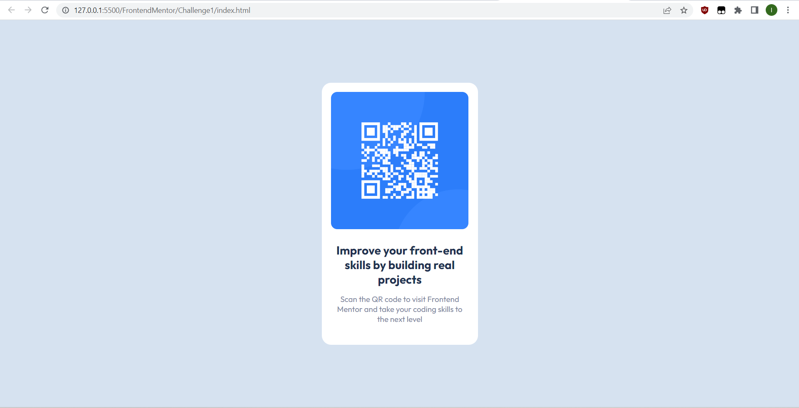
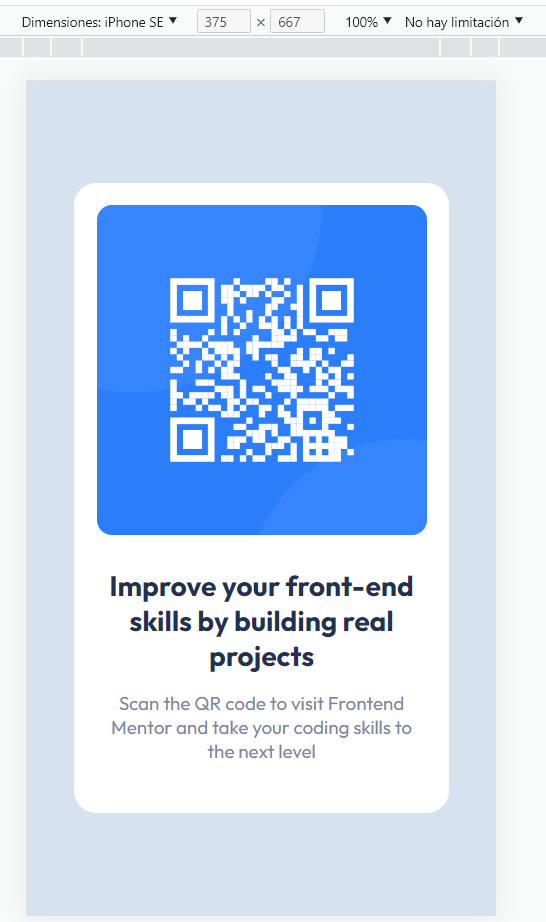

# Frontend Mentor - QR code component solution

This is a solution to the [QR code component challenge on Frontend Mentor](https://www.frontendmentor.io/challenges/qr-code-component-iux_sIO_H). Frontend Mentor challenges help you improve your coding skills by building realistic projects. 

## Table of contents

- [Overview](#overview)
  - [Screenshot](#screenshot)
  - [Links](#links)
- [My process](#my-process)
  - [Built with](#built-with)
  - [What I learned](#what-i-learned)
  - [Useful resources](#useful-resources)
- [Author](#author)

## Overview

### Screenshot

### Links

- Live Site URL: 

## My process

### Built with

- HTML
- CSS
- Google Fonts (as requested by the style guide)

### What I learned

There are some things I learned from this and I want to go and give it a try with bootstrap as this was made with vanilla html and css, but in the bootcamp i'm attending at this moment, the front-end module we did we worked with html / bootstrap, css and js.

### Useful resources

- [Example video](https://www.youtube.com/watch?v=5BBYPntB-GY) - I was having some difficulties with some things I forgot and getting the margin and padding right so I watched this video as reference.

## Author

- Website - [My GitHub, ig](https://github.com/NovaFugaz)
- Frontend Mentor - [@NovaFugaz](https://www.frontendmentor.io/profile/NovaFugaz)
- Twitter - [@ARagingStorm](https://www.twitter.com/ARagingStorm)
